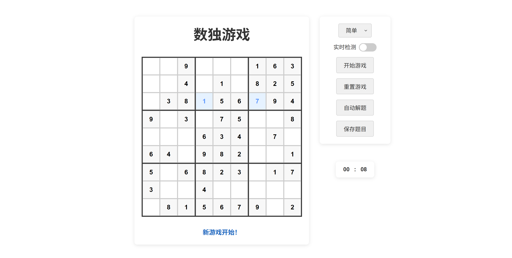
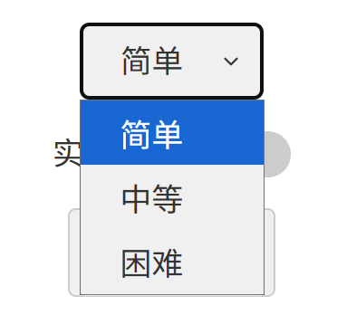
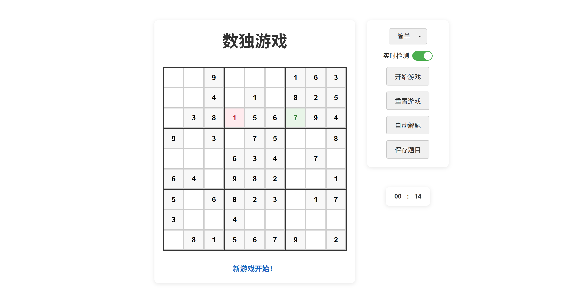
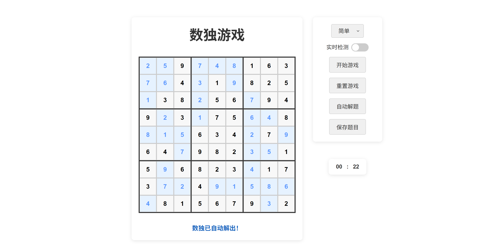

# 数独游戏

一个简单的数独游戏，支持多种难度、自动解题和保存题目功能。

## 项目结构

```
Sudoku-Game/
data
├── data/                   # 保存的题目数据目录
│   └── val-test/
│       ├── img/
│       │   └── .../
│       └── label/
│           └── .../
├── css/                   # 游戏样式文件
│   └── style.css
├── html/                  # 游戏主页面
│   └── index.html
├── js/                    # 游戏核心逻辑
│   └── script.js          
├── app.py                 # 服务器启动脚本
├── requirements.txt       # 项目依赖文件
├── info/                  # README.md图片内容
│   └── ...                
└── README.md              # 项目说明文档
```

## 如何运行
### 直接运行(不推荐)
- 直接在浏览器中打开 `html/index.html` 文件

### 使用服务器运行
- 使用 Python 运行服务器脚本：

1. 安装依赖
```bash
pip install -r requirements.txt
```
2. 运行服务器
```bash
python app.py
```
3. 然后在浏览器中访问 `http://localhost:15000`

## 游戏界面呈现
### 游戏界面
- 需要点击“开始游戏”按钮才能开始游戏
- “重置游戏”按钮用于清空[需要填写]的格子
- 计时器在填写第一个格子后开始计时


## 游戏功能
### 难度选择
- 多种难度选择（简单、中等、困难）


### 自动解题
- 实时检测功能


- 自动解题功能


### 保存题目功能
- 保存路径：`/data/val-test/*`
- 详细保存信息：
  - 图片路径：`*/img/[难度]/[题目编号].png`
  - JSON 路径：`*/json/[难度]/[题目编号].json`

## 更多开发：
  - 保存好的题目可以直接作为data在以下项目仓库链接进行识别使用
  - 项目仓库链接：[Sudoku-Auto-Solving](https://github.com/CyMelor/Sudoku-Auto-Solving)
